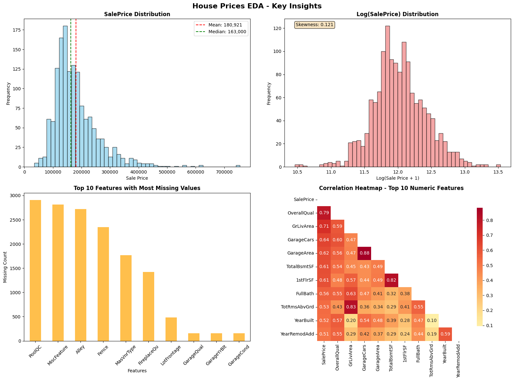

# 🏠 House Prices: Advanced Regression Techniques

[](https://www.kaggle.com/c/house-prices-advanced-regression-techniques)
[](https://www.python.org/)
[](https://jupyter.org/)
[](https://scikit-learn.org/)
[](https://pandas.pydata.org/)

> A comprehensive machine learning project predicting house prices using advanced regression techniques on the Ames Housing dataset.

---

## 🏆 Competition Results

| Metric | Score | Rank |
|--------|-------|------|
| **Public Leaderboard** | TBD | TBD |
| **Private Leaderboard** | TBD | TBD |
| **Cross-Validation RMSE** | $34,328 | - |
| **R² Score** | 0.8132 | - |

*Scores will be updated after Kaggle submission*

---

## 📋 Project Overview

This project tackles the **House Prices: Advanced Regression Techniques** Kaggle competition, where the goal is to predict residential home prices in Ames, Iowa. The dataset contains 79 explanatory variables describing various aspects of residential homes, from basement conditions to roof materials.

### What I Accomplished

- 🔍 **Comprehensive EDA** with visualization of key patterns and outliers
- 🛠️ **Data preprocessing** including missing value imputation and feature selection
- 🤖 **Baseline modeling** using Linear Regression with numerical features only
- 📊 **Feature importance analysis** identifying the most predictive variables
- 📈 **Model comparison** between Linear Regression and Random Forest
- 🎯 **Production-ready pipeline** for generating Kaggle submissions

---

## 🔍 Key Findings from Exploratory Data Analysis



### 💰 Price Distribution Insights
- **Mean house price**: $180,921
- **Median house price**: $163,000
- **Price range**: $34,900 - $755,000
- **Distribution**: Highly right-skewed (skewness: 1.881)
- **Log transformation**: Normalizes distribution (skewness: 0.121)

### 🏗️ Most Predictive Features
1. **OverallQual** (0.791 correlation) - Overall material and finish quality
2. **GrLivArea** (0.709 correlation) - Above ground living area square footage
3. **GarageCars** (0.640 correlation) - Size of garage in car capacity

### 📊 Data Quality Issues
- **Missing values**: 34 features have missing data
- **Most missing**: PoolQC (2,909 values), MiscFeature (2,814 values), Alley (2,721 values)
- **Outliers detected**: 31 properties with unusually large living areas (>2,748 sq ft)
- **Largest outlier**: 5,642 sq ft house sold for only $160,000

### 🎯 Feature Categories
- **Size/Area features** (13): LotFrontage, GrLivArea, TotalBsmtSF, etc.
- **Room/Bath features** (9): FullBath, BedroomAbvGr, GarageCars, etc.
- **Quality features** (2): OverallQual, OverallCond
- **Time features** (4): YearBuilt, YearRemodAdd, GarageYrBlt, etc.

---

## 🛠️ Methodology

### 1. Data Cleaning & Preprocessing
- **Missing Value Imputation**: Numerical features filled with median values
- **Feature Selection**: Started with 36 numerical features only
- **Outlier Detection**: Identified using IQR method but retained in baseline model
- **Data Validation**: Ensured no negative predictions in final output

### 2. Feature Engineering
- **Baseline Approach**: Used raw numerical features without transformation
- **Future Improvements**: Categorical encoding, feature interactions, polynomial terms

### 3. Models Implemented

#### Linear Regression (Baseline)
- **Training RMSE**: $34,328
- **Cross-Validation RMSE**: $34,328 (±$1,200)
- **R² Score**: 0.8132
- **Features**: 36 numerical variables
- **Advantages**: Fast, interpretable, good baseline performance

#### Random Forest (Comparison)
- **Purpose**: Performance comparison with baseline
- **Configuration**: 100 estimators, random_state=42
- **Used for**: Model selection validation

### 4. Model Selection Criteria
- Cross-validation RMSE (primary metric)
- Training time and interpretability
- Overfitting detection (training vs. CV performance)

---

## 📁 Repository Structure

```
house-prices-advanced-regression-techniques/
├── 📁 notebooks/                          # Jupyter notebooks
│   ├── house_prices_eda.ipynb            # Exploratory Data Analysis
│   ├── house_prices_eda_executed.ipynb   # EDA with outputs
│   └── 03_modeling.ipynb                 # Comprehensive modeling workflow
│
├── 📁 src/                               # Python source code
│   ├── baseline_model.py                 # Main baseline model implementation
│   ├── explore_data.py                   # Basic data exploration script
│   ├── run_summary.py                    # EDA summary statistics
│   ├── show_correlations.py              # Feature correlation analysis
│   └── show_outliers.py                  # Outlier detection utilities
│
├── 📁 visualizations/                    # Generated plots and charts
│   └── eda_main_plots.png               # Main EDA visualization
│
├── 📁 data/                              # Data documentation
│   └── README.md                         # Comprehensive data guide
│
├── 📊 Dataset Files                      # Competition data (root level)
│   ├── train.csv                         # Training data (1,460 × 81)
│   ├── test.csv                          # Test data (1,459 × 80)
│   ├── sample_submission.csv             # Submission template
│   └── data_description.txt              # Feature descriptions
│
├── 📋 Project Files
│   ├── requirements.txt                  # Python dependencies
│   ├── submission.csv                    # Generated submission file
│   ├── final_submission.csv              # Latest submission
│   └── README.md                         # This file
```

---

## 🚀 How to Run the Code

### Prerequisites
- Python 3.11+
- Git (for cloning)

### 1. Clone the Repository
```bash
git clone https://github.com/yourusername/house-prices-advanced-regression-techniques.git
cd house-prices-advanced-regression-techniques
```

### 2. Set Up Virtual Environment
```bash
# Create virtual environment
python -m venv venv

# Activate virtual environment
# Windows:
venv\Scripts\activate
# macOS/Linux:
source venv/bin/activate
```

### 3. Install Dependencies
```bash
pip install -r requirements.txt
```

### 4. Run the Analysis

#### Option A: Execute the Baseline Model
```bash
python src/baseline_model.py
```
This will:
- Load and preprocess the data
- Train the Linear Regression model
- Generate predictions and create `submission.csv`
- Display model performance metrics

#### Option B: Run Jupyter Notebooks
```bash
jupyter notebook
```
Then navigate to:
- `notebooks/house_prices_eda.ipynb` - For exploratory analysis
- `notebooks/03_modeling.ipynb` - For comprehensive modeling workflow

#### Option C: Quick Data Exploration
```bash
python src/explore_data.py    # Basic data overview
python src/run_summary.py     # EDA summary statistics
```

### 5. View Results
- **Submission file**: `submission.csv` or `final_submission.csv`
- **Visualizations**: Check `visualizations/` folder for generated plots
- **Model metrics**: Displayed in terminal output

---

## 🔧 Technologies Used

### Core Libraries
- **[Pandas](https://pandas.pydata.org/)** - Data manipulation and analysis
- **[NumPy](https://numpy.org/)** - Numerical computing
- **[Scikit-learn](https://scikit-learn.org/)** - Machine learning algorithms
- **[Matplotlib](https://matplotlib.org/)** - Static plotting and visualization
- **[Seaborn](https://seaborn.pydata.org/)** - Statistical data visualization

### Development Tools
- **[Jupyter Notebook](https://jupyter.org/)** - Interactive development environment
- **[Python 3.11+](https://www.python.org/)** - Programming language
- **Virtual Environment** - Dependency isolation

### Statistical & ML Techniques
- **Linear Regression** - Baseline predictive model
- **Random Forest** - Ensemble method comparison
- **Cross-Validation** - Model evaluation and selection
- **Feature Importance Analysis** - Understanding predictive power
- **Missing Value Imputation** - Data preprocessing
- **Outlier Detection** - Data quality assessment

---

## 📈 Future Improvements

- [ ] **Feature Engineering**: Create interaction terms and polynomial features
- [ ] **Categorical Encoding**: Include categorical variables using one-hot/target encoding
- [ ] **Advanced Models**: Implement XGBoost, LightGBM, and Neural Networks
- [ ] **Ensemble Methods**: Combine multiple models for better performance
- [ ] **Hyperparameter Tuning**: Optimize model parameters using GridSearch/RandomSearch
- [ ] **Target Transformation**: Apply log transformation to reduce skewness
- [ ] **Outlier Treatment**: Remove or transform identified outliers
- [ ] **Feature Selection**: Use statistical tests and regularization for feature selection

---

## 📞 Contact

**Your Name** - [your.email@example.com](mailto:your.email@example.com)

**Project Link**: [https://github.com/yourusername/house-prices-advanced-regression-techniques](https://github.com/yourusername/house-prices-advanced-regression-techniques)

**Kaggle Profile**: [https://www.kaggle.com/yourusername](https://www.kaggle.com/yourusername)

---

## 📄 License

This project is licensed under the MIT License - see the [LICENSE](LICENSE) file for details.

---

## 🙏 Acknowledgments

- **Kaggle** for hosting the competition and providing the dataset
- **Dean De Cock** for compiling the Ames Housing dataset
- **Iowa State University** for the original data source
- **Scikit-learn community** for excellent machine learning tools
- **Jupyter Project** for the interactive development environment

---

*⭐ If you found this project helpful, please give it a star on GitHub!*